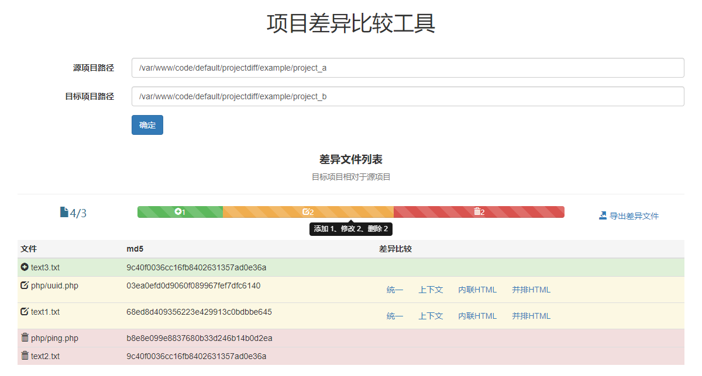
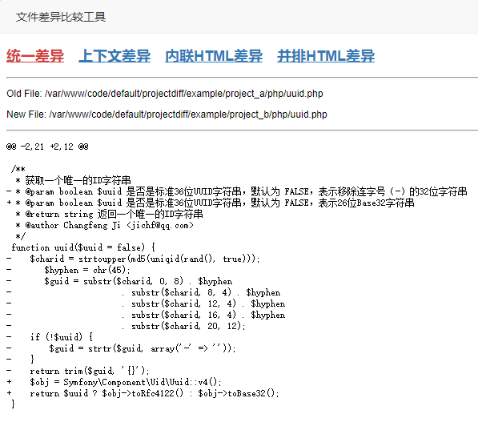
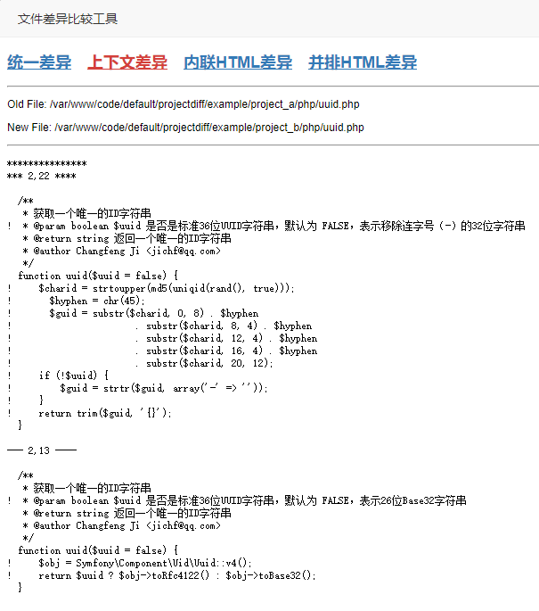
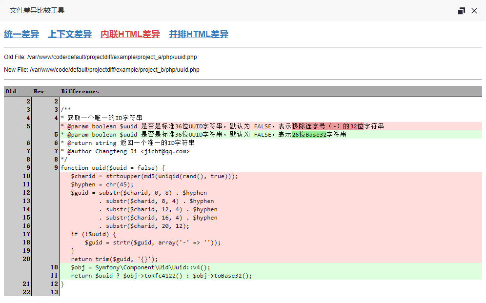
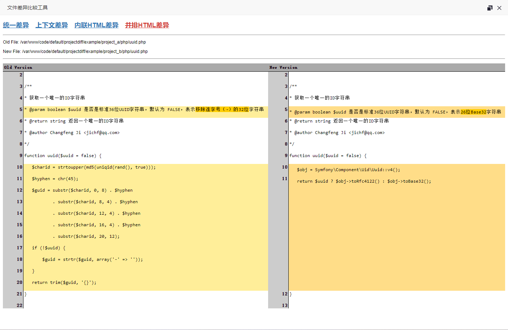

# 概述

项目差异比较工具，基于 [php-diff](https://github.com/chrisboulton/php-diff) 实现。

# Web 服务器配置
 - 使用 Apache/Nginx 等都可以，甚至 PHP 的内置 Web Server 也可以。
 - 示例访问地址：http://ip/projectdiff/index.html

# 示例截图

#### 首页
 - 

#### 差异比较-统一差异
 - 

#### 差异比较-上下文差异
 - 

#### 差异比较-内联HTML差异
 - 

#### 差异比较-并排HTML差异
 - 